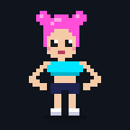
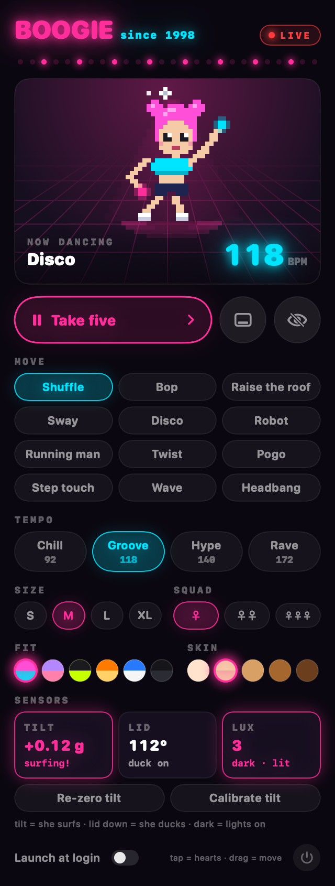
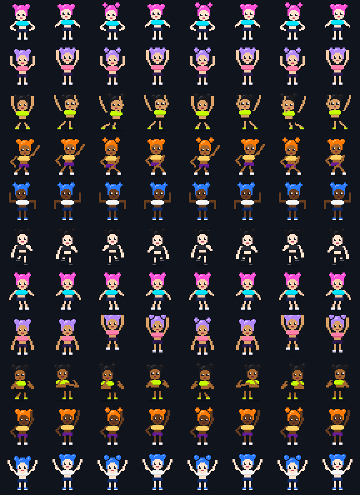

<p align="center">
  
</p>

<h1 align="center">Boogie</h1>
<p align="center"><b>There's a girl on your Dock. She's not leaving.</b></p>

<p align="center">
  
</p>

In 1998 an app called VirtuaGirl put a stripper on your Windows taskbar, and a
generation of teenagers learned what "minimise all windows" was for.

This is the Mac version. Twenty-eight years later, considerably more pixelated.

## What she does

She stands on your Dock and dances. That's the whole app. That's the whole pitch.

Eleven moves, shuffled every two bars: bop, raise the roof, sway, disco, robot,
running man, twist, pogo, step touch, wave, headbang. She blinks. Her buns
bounce a frame late, because physics is hot.

- **Click her.** She jumps and throws hearts at you. Needy? A little. Aren't we all.
- **Drag her.** She'll go anywhere. Your second monitor. The corner of your
  spreadsheet. Directly on top of your manager's face in Zoom.
- **Right-click her** (or hit the `🕺` in the menu bar) for the club panel: neon
  marquee, a live stage preview, and every dial she has. She takes requests.
- **Tempo** runs from Chill (92 BPM, a slow Tuesday) to Rave (172 BPM, a poor decision).
- **Fit:** six outfits. **Skin:** five tones. She's not picky, and neither should you be.
- **Squad:** bring a duo or a trio. Odd-numbered dancers mirror the moves, so it
  looks choreographed rather than like three strangers who just met on the Dock.
- **Take five** when HR walks past. **Hide** when they walk back.

## She knows what you're doing with that laptop

MacBooks have sensors nobody uses. She uses them.

- **Tilt it** and she surfs. Lift the right edge and she slides right along
  the Dock, arms out, until she hits the screen edge and bounces. Set it back
  down and she stops wherever she landed. Physics, not animation.
- **Close the lid on her** and she ducks. Below 85° she braces, below 60° she
  crouches, below 40° she's flat on the floor with her arms out. Open it back
  up and she pops up throwing hearts, because she thought that was it.
- **Turn the lights off** and the club opens: a mirror ball drops in, a spotlight
  sweeps through pink, cyan, violet and lime on every beat, the floor glows,
  and she's holding glow sticks.

Each one has a live readout in the panel (tilt in g, hinge angle, lux), taps
on and off, and the lights have an always-on mode for daylight raving. If she
slides the wrong way, **Calibrate tilt** fixes it in two taps: level, tilt right, done.
All three come off the built-in sensors with no permissions at all.

## What she doesn't do

- **Ask for permissions.** No Accessibility, no Screen Recording, no location.
  She's low-maintenance.
- **Phone home.** No network code, no analytics, no telemetry. What happens on
  your Dock stays on your Dock.
- **Show up in ⌘-Tab.** She's discreet.
- **Use your CPU.** A sliver at 30 fps. She's mostly just standing there looking good.

<p align="center">
  
</p>

<p align="center">
  
</p>

## Install

### Option 1: Let an agent do it

Paste this into Claude Code (or any coding agent):

> Clone https://github.com/pratikaman/Boogie, run `./build.sh --install`, and launch ~/Applications/Boogie.app

### Option 2: Build it yourself

```sh
git clone https://github.com/pratikaman/Boogie.git
cd Boogie
./build.sh --install   # builds Boogie.app and installs it to ~/Applications
open ~/Applications/Boogie.app
```

Needs macOS 13+ and the Xcode command line tools. No Xcode project, no packages,
no dependencies: `build.sh` is one `swiftc` call and a hand-rolled bundle.
Tick **Launch at login** in her menu and she'll be waiting for you every morning.

## Under the hood

The whole dancer is code. `Sources/Sprite.swift` holds a 36×36 pixel canvas, a
hand-drawn head and torso as ASCII art, and procedural two-pixel arms and legs so
every move can pose her freely. Each move is a pure function from *beats since
the move started* to a `Pose`. The renderer paints the pose into an RGBA buffer,
and a `CALayer` with nearest-neighbour magnification blows it up to whatever size
you picked, so she stays crisp at any scale. Size queen friendly.

She lives in a borderless, non-activating `NSPanel` at status-bar level, so she
floats above your windows and the Dock and follows you across every Space.
Clicks on transparent pixels fall through to whatever's underneath.

The control panel is SwiftUI in an `NSPopover`: black-light purple, neon pink
and cyan, chasing cabaret bulbs, and a synthwave floor under a live preview
rendered from the same sprite code, in sync with the dancer on your Dock.

The sensors are the fun part. The accelerometer only talks through the private
`IOHIDEventSystemClient` interface (a rate-controlled client with an event
callback, see `Sources/Private.h`); the hinge angle is a HID feature report on
the lid sensor; the ambient light sensor answers `IOHIDServiceClientCopyEvent`.
`Sources/Sensors.swift` wraps all three, `Sources/Crossover.swift` turns them
into behaviour, and any of them missing just switches that trick off. Run with
`BOOGIE_FAKE_TILT`, `BOOGIE_FAKE_LID` or `BOOGIE_FAKE_LUX` set to try it on a
desk without moving anything, and `BOOGIE_DEBUG_SENSORS=1` to log readings.

The app icon and the GIF above are rendered from the same sprite code by
`tools/main.swift`, so there's a single source of truth for how she looks.

Built entirely on vibes. Keep your hands where I can see them.
