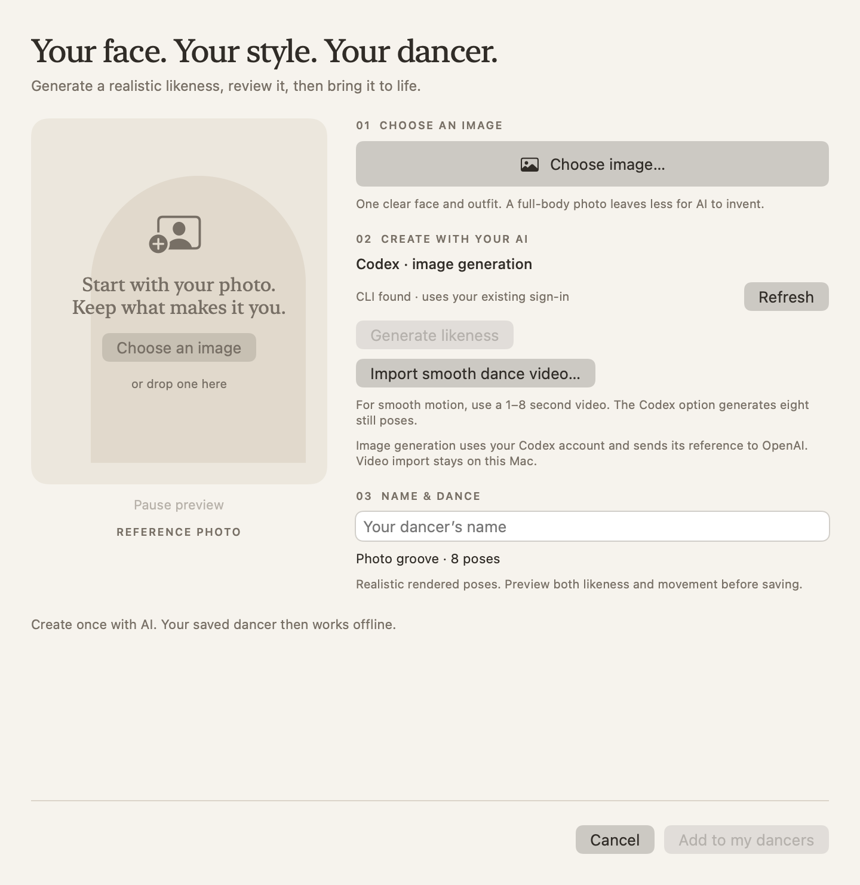

<p align="center">
  
</p>

<h1 align="center">boogie.</h1>
<p align="center">A little company for your desktop.</p>

Boogie puts a dancing companion on your Mac's Dock. Choose **Sophia**,
**Manuel**, **Carla**, or **Nathan**, four realistic, scanned 3D people rendered with soft studio lighting
and motion-captured movement. They live in transparent windows, follow you
across Spaces, and work entirely offline.

<p align="center">
  
</p>

## Make yourself at home

- **Click** a companion for a little jump and hearts.
- **Drag and drop** them anywhere. Gravity brings them back to the Dock.
- **Right-click** a person, or use the menu-bar icon, to open the controls.
- **Create a dancer**: use Codex image generation to create a realistic likeness and an animated dance loop from your photo.
- Pick **Easy groove**, **High kicks**, or **Step & dip**, or let **Shuffle all dances** rotate through the full routines.
- Choose an **Easy**, **Groove**, **Upbeat**, or **Party** pace.
- Pick a size and bring a **solo, duo, or trio**, or choose **Custom** to select your own lineup. Mix people, pixel classics, and saved dancers; use **+ / −** beside each name to add or remove copies, with no three-dancer limit. Your lineup is saved between launches.
- **Pause**, **hide**, or **return to Dock** from the main panel.
- Open **Preferences** to enable launch at login and sensor reactions.

The panel uses warm paper colors, a terracotta accent, and a quiet live preview.
The original Boogie, Bruce, and Jazz sprites are still available under **Pixel
classics**, with their eleven moves. Boogie's outfit and skin controls live in
Preferences. The scanned people keep their original clothes and share three
motion-captured routines. Dance choices persist separately for people and pixel
classics. Pause and hide stay within reach below the scrolling controls.

## Create your own dancer

Open the controls and choose **Create a dancer**:

1. Choose or drop a clear photo of one person. A visible face and full outfit work best.
2. Click **Generate likeness**. Boogie sends the photograph itself to Codex's built-in
   image model, asking it to preserve the face, proportions, hair, glasses and clothes
   in a realistic full-body 3D-style render with a transparent background.
3. **Review the likeness first.** Regenerate if needed, then click **Make 8-pose preview**.
   The image model uses that likeness as the reference for eight distinct dance poses.
   This is a limited pose preview, not continuous motion.
4. Preview the loop, name the dancer, and click **Add to my dancers**. A source photo
   or unanimated portrait cannot be saved as a finished dancer.

The result is a **rendered animation**, not a rotatable 3D mesh. Realistic images
replace the old primitive-based toy generator. An image model can still change details,
and unseen body parts must be inferred; inspect the preview before saving. Boogie
validates the sheet, extracts transparent frames, aligns their scale and feet, and
plays the loop at your chosen tempo. Eight still poses cannot match the smoothness of the
bundled motion-capture animations. Increasing playback speed or crossfading them
does not create correct in-between anatomy. Existing toy avatars and photo cutouts still work.

**For smooth dancing:** choose **Import smooth dance video…** (or drop an MP4/MOV).
Use a 1–8 second continuous, looping clip at 20 fps or higher, showing one full-body
person with a fixed camera. Boogie extracts 24 frames per second, removes the background
locally with Apple Vision, and applies one crop and scale to the whole clip to avoid
position jitter. It keeps the clip's motion, including the transition at its loop boundary;
use a clip that already loops cleanly. Playback follows the app's tempo and works offline.
A video's original audio is not imported. Files must be smaller than 100 MB.

Generating such a clip from a likeness requires a video-generation service; Codex's
image model does not supply a continuous video. Boogie currently imports the resulting
video file—it does not include a video-provider integration or subscription.

**AI setup:** install a current Codex CLI, sign in with `codex login`, and check that
image generation is available to your account. **Locate CLI…** supports nonstandard
installations. This path uses Codex's own image tool and sign-in; no separate image
API key is required. Claude Code is no longer offered in this flow because a text-only
session cannot supply the required generated images. Boogie reports missing image
capabilities instead of silently substituting a generic character.

**AI access and privacy:** each generation step sends a metadata-free reference image
through Codex to OpenAI. Your account's usage limits apply. Boogie uses the supported
noninteractive CLI interface without reading or copying tokens. The CLI runs read-only,
with shell, subagent, app and plugin tools disabled and image generation enabled.
Temporary input files and logs are removed after completion or cancellation; Codex's
own generated image files remain in its `generated_images` directory. Boogie only
accepts newly generated, bounded PNGs from that directory, never model-generated code.
See [Codex noninteractive mode](https://developers.openai.com/codex/noninteractive).

Saved playback works offline. Tempo, pause, hide, click, drag and sensor reactions
apply to custom dancers. **Photo groove** plays the eight generated poses; **Video dance** plays
the continuous imported clip. Neither invents additional routines. Custom duos and trios cycle through **My dancers**.

Choose **Edit** to rename, replace the photo and regenerate, or delete a dancer.
Normalized frames live in `~/Library/Application Support/Boogie/Custom Dancers/`
and do not depend on the original photo or a continuing AI connection.

<p align="center">
  
</p>

## Responds to your Mac

On supported MacBooks, tilt makes companions slide and lean, lowering the lid
makes them crouch, and low light adds an evening glow. Each reaction can be
configured independently. Missing sensors disable the corresponding controls;
lighting can also be enabled manually. Tilt calibration lives in Preferences.

## Build and run

Requires macOS 13+ and Xcode command line tools. No Xcode project, Swift packages,
or runtime downloads are needed.

```sh
./build.sh
open build/Boogie.app
```

To replace the copy in your Applications folder:

```sh
./build.sh --install
open ~/Applications/Boogie.app
```

Builds are signed locally. `build.sh` recreates `build/`, bundles character
artwork, and regenerates the app icon.

## Development and validation

```sh
./tools/test.sh
build/Boogie.app/Contents/MacOS/Boogie --render-panel build/panel.png --sample-library
build/Boogie.app/Contents/MacOS/Boogie --render-panel build/lineup.png --sample-library --lineup sophia,manuel,carla,nathan,jazz,sophia
build/Boogie.app/Contents/MacOS/Boogie --render-panel build/preferences.png --preferences
build/Boogie.app/Contents/MacOS/Boogie --render-panel build/manuel.png --character manuel
build/Boogie.app/Contents/MacOS/Boogie --render-panel build/carla.png --character carla --dance high-kicks
build/Boogie.app/Contents/MacOS/Boogie --render-creator build/creator.png
build/Boogie.app/Contents/MacOS/Boogie --render-creator build/custom-preview.png --image /path/to/photo.png
build/Boogie.app/Contents/MacOS/Boogie --render-avatar build/avatar.png
build/Boogie.app/Contents/MacOS/Boogie --render-creator build/creator-ready.png --avatar-design tools/fixtures/avatar.json
```

The tests use mock CLI processes, bundled artwork, a two-second video rendered from
Sophia, and a legacy design fixture;
they never send images to AI services. To explicitly exercise Codex image generation
(uses that account's allowance):

```sh
build/Boogie.app/Contents/MacOS/Boogie --generate-likeness build/likeness.png --image /path/to/photo.png
build/Boogie.app/Contents/MacOS/Boogie --render-creator build/creator.png --likeness build/likeness.png
# Inspect a generated four-column, two-row dance sheet locally:
build/Boogie.app/Contents/MacOS/Boogie --prepare-dance build/dance.json --sheet /path/to/sheet.png
build/Boogie.app/Contents/MacOS/Boogie --prepare-video build/video-dance.json --video /path/to/dance.mp4
build/Boogie.app/Contents/MacOS/Boogie --render-creator build/dance-preview.png --dance-json build/dance.json
```

Snapshot options also include `--paused` and `--hidden`. To exercise sensors
without moving your Mac, launch the binary directly:

```sh
BOOGIE_FAKE_LID=30 BOOGIE_FAKE_LUX=0 BOOGIE_DEBUG_SENSORS=1 \
  build/Boogie.app/Contents/MacOS/Boogie
```

Tilt uses `BOOGIE_FAKE_TILT="0.2,0,-0.98"` and
`BOOGIE_FAKE_TILT_AFTER=2` to allow initial zeroing.

`Sources/Panel.swift` contains the SwiftUI interface. `Companions.swift` loads
rendered animation frames through a bounded atlas cache; `Dancer.swift` draws
them using native layers. Both the preview and Dock use the same beat clock,
including pause and tempo changes. Transparent margins pass clicks through.
`Sprite.swift` remains the renderer for the pixel classics.
`CustomDancers.swift` handles imports, background extraction, atomic storage,
and legacy cutouts. `Creator.swift` contains the editor. `LikenessAI.swift` handles
image-model prompts and validated output paths; `GeneratedDance.swift` extracts,
aligns and plays generated poses and continuous clips. `VideoDance.swift` imports
video and performs local background removal. `AvatarAI.swift` supplies CLI discovery and the
cancellable subprocess runner. `Avatar.swift` keeps legacy toy avatars playable.

## Character credits

Sophia, Manuel, Carla, and Nathan are by [Renderpeople](https://renderpeople.com/free-3d-people/).
Their models are licensed, not public-domain assets. This repository includes
rendered animation artwork; it does not include the source meshes, textures, or
rigs. See [character sources, usage terms, and rendering instructions](assets/CHARACTERS.md).

Ordinary builds use the bundled renders. Regenerating them requires Blender 4.5
and Pillow as development tools. Built-in characters and saved custom avatars
need no network access. Only an explicit AI-generation action invokes an external
provider through the user's CLI; Boogie has no analytics or telemetry.
